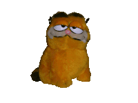

<h2 data-importer="text" align="left">Hi 👋! My name is 69-bits</h2>

###

  
  

###

###

  
  
  
  
  
  
  
  
  
  
  
  
  
  
  
  
  
  
  
  
  
  
  
  
  
  
  
  
  
  
  
  
  

###

  
  
  
  
  
  

###

 

<picture data-importer="pacman">
  <source media="(prefers-color-scheme: dark)" srcset="https://raw.githubusercontent.com/69-bits/69-bits/pacman-output/bomberman-contribution-graph-dark.svg?game=bomberman">
  <source media="(prefers-color-scheme: light)" srcset="https://raw.githubusercontent.com/69-bits/69-bits/pacman-output/bomberman-contribution-graph.svg?game=bomberman">
  
</picture>

###
